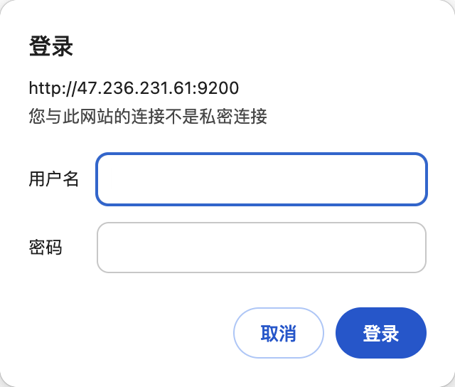
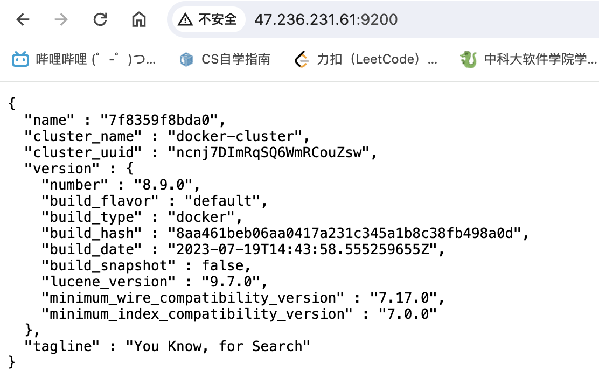
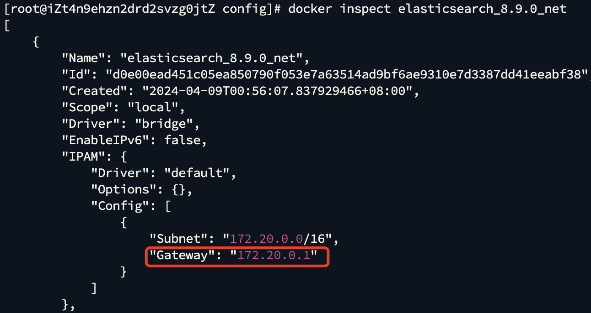
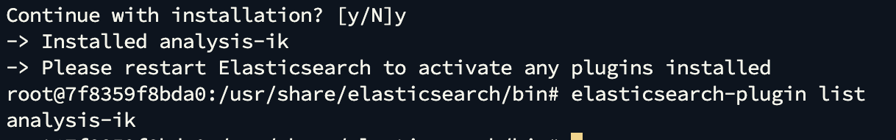

本文档记录了本项目所用环境如何使用docker进行配置。部分环境搭建较为繁琐，也可直接访问47.236.231.61+端口号进行使用。

关于docker容器，可以使用portainer进行可视化管理操作。如果对应的服务被停止，可以访问47.236.231.61:9000打开相应容器。
在本机上完成基础开发后，再通过学校的服务器进行开发。

账号：gregorio

密码：Zhe945dmima6.

### MySQL

创建文件：

````shell
mkdir /mysql/data
touch /mysql/my.cnf
vim /mysql/my.cnf
````

修改配置文件

```shell
[mysql]
#设置mysql客户端默认字符集
default-character-set=UTF8MB4
[mysqld]
#设置3306端口
port=3306
#允许最大连接数
max_connections=200
#允许连接失败的次数
max_connect_errors=10
#默认使用“mysql_native_password”插件认证
default_authentication_plugin=mysql_native_password
#服务端使用的字符集默认为8比特编码的latin1字符集
character-set-server=UTF8MB4
#开启查询缓存
explicit_defaults_for_timestamp=true
#创建新表时将使用的默认存储引擎
default-storage-engine=INNODB
#等待超时时间秒
wait_timeout=60
#交互式连接超时时间秒
interactive-timeout=600
```

保存后输入下列命令运行容器

````shell
docker run \
  -d \
  -p 3306:3306 \
  -v /mysql/data:/var/lib/mysql \
  -v /mysql/my.cnf:/etc/mysql/conf.d/my.cnf \
  -e MYSQL_ROOT_PASSWORD=gcsj1234 \
  --restart=always \
  --privileged=true \
  --name mysql \
  mysql:8.2
````

### redis

````shell
docker run -p 6379:6379 --name redis -d redis  --requirepass gcsj1234
````

### elastic search

#### 安装elasticsearch

##### 1. 拉取镜像并创建自定义网桥

````shell
docker pull elasticsearch:8.9.0
docker network create elasticsearch_8.9.0_net
````

##### 2. 创建临时节点挂载容器卷

```shell
docker run -d -p 9200:9200 -p 9300:9300 -e ES_JAVA_OPTS="-Xms256m -Xmx256m" -e "discovery.type=single-node" --name elasticsearch_8.9.0 elasticsearch:8.9.0
```

拷贝容器卷的地址：

````shell
docker cp -a elasticsearch_8.9.0:/usr/share/elasticsearch/config /home/docker/volume/elasticsearch_8.9.0
docker cp -a elasticsearch_8.9.0:/usr/share/elasticsearch/data /home/docker/volume/elasticsearch_8.9.0
docker cp -a elasticsearch_8.9.0:/usr/share/elasticsearch/logs /home/docker/volume/elasticsearch_8.9.0
docker cp -a elasticsearch_8.9.0:/usr/share/elasticsearch/plugins /home/docker/volume/elasticsearch_8.9.0
````

##### 3. 创建es真实节点

停止并删除原临时节点

````shell
docker stop elasticsearch_8.9.0
docker rm elasticsearch_8.9.0
````

创建真实的es节点

````shell
docker run -d -p 9200:9200 -p 9300:9300 --privileged=true -e "discovery.type=single-node" -e ES_JAVA_OPTS="-Xms512m -Xmx512m" -v /home/docker/volume/elasticsearch_8.9.0/plugins:/usr/share/elasticsearch/plugins -v /home/docker/volume/elasticsearch_8.9.0/data:/usr/share/elasticsearch/data -v /home/docker/volume/elasticsearch_8.9.0/logs:/usr/share/elasticsearch/logs -v /home/docker/volume/elasticsearch_8.9.0/config:/usr/share/elasticsearch/config --network elasticsearch_8.9.0_net --name elasticsearch_8.9.0 elasticsearch:8.9.0
````

进入挂载目录下的config文件夹，打开elastic search.yml文件，修改设置xpack.security.http.ssl.enabled: false

````shell
cluster.name: "docker-cluster"
network.host: 0.0.0.0

#----------------------- BEGIN SECURITY AUTO CONFIGURATION -----------------------
#
# The following settings, TLS certificates, and keys have been automatically      
# generated to configure Elasticsearch security features on 08-04-2024 17:27:09
#
# --------------------------------------------------------------------------------

# Enable security features
xpack.security.enabled: true

xpack.security.enrollment.enabled: true

# Enable encryption for HTTP API client connections, such as Kibana, Logstash, and Agents
xpack.security.http.ssl:
  enabled: false
  keystore.path: certs/http.p12

# Enable encryption and mutual authentication between cluster nodes
xpack.security.transport.ssl:
  enabled: true
  verification_mode: certificate
  keystore.path: certs/transport.p12
  truststore.path: certs/transport.p12
#----------------------- END SECURITY AUTO CONFIGURATION -------------------------
````

访问9200端口，出现如下窗口：



##### 4. 生成随机密码

进入容器，重置得到随机密码

````shell
docker exec -it elasticsearch_8.9.0 bash
cd bin/
elasticsearch-reset-password -u elastic
````

得到密码如下：hq+Fp9BpVOl*h0r6SbR8

````shell
elasticsearch@7f8359f8bda0:~/bin$ elasticsearch-reset-password -u elastic
WARNING: Owner of file [/usr/share/elasticsearch/config/users] used to be [root], but now is [elasticsearch]
WARNING: Owner of file [/usr/share/elasticsearch/config/users_roles] used to be [root], but now is [elasticsearch]
This tool will reset the password of the [elastic] user to an autogenerated value.
The password will be printed in the console.
Please confirm that you would like to continue [y/N]y


Password for the [elastic] user successfully reset.
New value: hq+Fp9BpVOl*h0r6SbR8
````

接下来，我们可以用该密码登录elasticsearch，用户名为elastic。登录完成后可以看到以下界面



#### 安装kibana

##### 1. 创建临时节点并挂载容器卷

创建临时节点

````shell
docker run -d --name kibana_8.9.0 -p 5601:5601 kibana:8.9.0
````

设置挂载地址

```shell
docker cp kibana_8.9.0:/usr/share/kibana/config/ /home/docker/volume/kibana_8.9.0
```

##### 2. 删除临时节点

```shell
docker stop kibana_8.9.0
docker rm kibana_8.9.0
```

##### 3. 创建真实节点

````shell
docker run -d --name kibana_8.9.0 --network elasticsearch_8.9.0_net -p 5601:5601 -v /home/docker/volume/kibana_8.9.0/config:/usr/share/kibana/config kibana:8.9.0
````

##### 4. 创建es用户

进入elasticsearch容器

```shell
docker exec -it elasticsearch_8.9.0 bash
cd bin
elasticsearch-users useradd logadmin
Enter new password: gcsj1234
```

创建完成后赋予它对应的权限

```shell
elasticsearch-users roles -a superuser logadmin
elasticsearch-users roles -a kibana_system logadmin
```

##### 5. 修改配置文件

查看网桥对应的地址

```shell
docker network inspect elasticsearch_8.9.0_net
```



得到网桥的ip为172.20.0.1后，直接进入挂载卷修改配置文件。

````shell
cd /home/docker/volume/kibana_8.9.0/config
vim kibana.yml
````

修改配置文件如下：

```shell
#
# ** THIS IS AN AUTO-GENERATED FILE **
#

# Default Kibana configuration for docker target
server.host: "0.0.0.0"
server.shutdownTimeout: "5s"
elasticsearch.hosts: [ "http://172.20.0.1:9200" ]
elasticsearch.username: logadmin
elasticsearch.password: gcsj1234
xpack.screenshotting.browser.chromium.disableSandbox: true
monitoring.ui.container.elasticsearch.enabled: true
```

重启kibana

````shell
docker restart kibana_8.9.0
````

此时再访问5601端口，用账号密码登录即可。

#### 安装IK分词器

由于es默认是对每个英文单词进行索引，而对中文是每个汉字进行索引，所以我们要安装ik分词器来提升es对于中文的检索效率。

ik分词器的安装较为简单，进入容器bin目录后执行以下脚本即可。

```shell
# 以0号用户（root用户）进入容器
docker exec -u 0 -it elasticsearch_8.9.0 bash
cd bin

elasticsearch-plugin install https://github.com/medcl/elasticsearch-analysis-ik/releases/download/v8.9.0/elasticsearch-analysis-ik-8.9.0.zip
# 如果访问不了github或者网络情况较差，可以使用国内代理
elasticsearch-plugin install hhtps://ghproxy.com/https://github.com/medcl/elasticsearch-analysis-ik/releases/download/v8.9.0/elasticsearch-analysis-ik-8.9.0.zip
```

安装完成后，检查插件是否安装成功。

````shell
elasticsearch-plugin list
````



重启es使ik分词器插件生效

````shell
docker restart elasticsearch_8.9.0
````

### kafka

##### 安装zookeeper

创建一个网络：

````shell
docker network create app-tier --driver bridge
````

````shell
docker run -d --name zookeeper-server \
    --network app-tier \
    -e ALLOW_ANONYMOUS_LOGIN=yes \
    bitnami/zookeeper:latest
````

##### 安装Kafka

安装并运行Kafka，
–name：容器名称
-p：设置映射端口（默认9092 ）
-d：后台启动
ALLOW_PLAINTEXT_LISTENER任何人可以访问
KAFKA_CFG_ZOOKEEPER_CONNECT链接的zookeeper
ALLOW_PLAINTEXT_LISTENER任何人可以访问
KAFKA_CFG_ZOOKEEPER_CONNECT链接的zookeeper
KAFKA_CFG_ADVERTISED_LISTENERS当前主机IP或地址（重点：如果是服务器部署则配服务器IP或域名否则客户端监听消息会报地址错误）

````shell
docker run -d --name kafka-server \
    --network app-tier \
    -p 9092:9092 \
    -e ALLOW_PLAINTEXT_LISTENER=yes \
    -e KAFKA_CFG_ZOOKEEPER_CONNECT=zookeeper-server:2181 \
    -e KAFKA_CFG_ADVERTISED_LISTENERS=PLAINTEXT://172.16.120.74:9092 \
    bitnami/kafka:latest
````

##### 安装Kafka-map

Kafka图形化管理工具
访问地址：http://服务器IP:9001/
DEFAULT_USERNAME：默认账号admin
DEFAULT_PASSWORD：默认密码admin
Git 地址：https://github.com/dushixiang/kafka-map/blob/master/README-zh_CN.md

````shell
docker run -d --name kafka-map \
    --network app-tier \
    -p 9001:8080 \
    -v /opt/kafka-map/data:/usr/local/kafka-map/data \
    -e DEFAULT_USERNAME=admin \
    -e DEFAULT_PASSWORD=admin \
    --restart always dushixiang/kafka-map:latest
````

##### 打开和关闭端口号

````shell
nft add rule ip filter input tcp dport 9001 accept
````

### 安装mongoDB

https://cloud.tencent.com/developer/article/1630512

运行启动命令

个人主机运行命令：

````shell
docker run -p 27017:27017 -v /data/mongo:/data/db --name mongodb -d mongo
````

学校服务器运行命令：

````shell
docker run -p 27017:27017 -v /home/gcsj/dev-environment-files/data/mongo:/data/db --name mongodb -d mongo
````

在上面的命令中，几个命令参数的详细解释如下：

-p 映射[容器服务](https://cloud.tencent.com/product/tke?from_column=20065&from=20065)的 27017 端口到[宿主机](https://cloud.tencent.com/product/cdh?from_column=20065&from=20065)的 27017 端口。外部可以直接通过 宿主机 ip:27017 访问到 mongo 的服务

-v 为设置容器的挂载目录，这里是将本机的“/home/gcsj/dev-environment-files/data/mongo:/data/db”目录挂载到容器中的/data/db中，作为 mongodb 的存储目录

--name 为设置该容器的名称

-d 设置容器以守护进程方式运行

下面进入容器，设置用户名和密码

````shell
docker exec -it mongodb bash
mongosh
# 创建超级权限root角色的用户，或者userAdminAnyDatabase 等角色权限比较大的用户，我创建的是拥有超级权限root角色的用户root
# 用户名：root，密码：root，角色：root，数据库：admin
db.createUser({user:'root',pwd:'root',roles:[{role:'root',db:'admin'}]})
````


